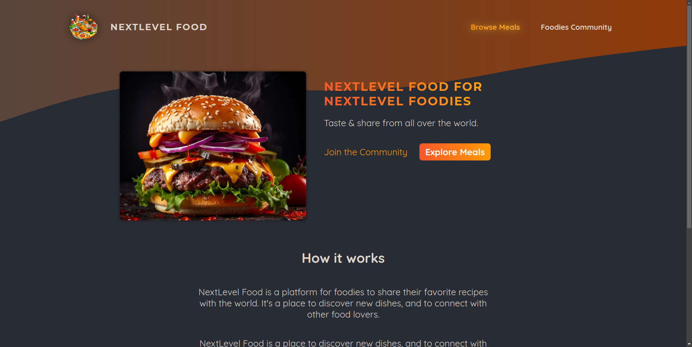

# NEXTLEVEL FOOD

## Description

This is a [Next.js](https://nextjs.org/) project created during the course ["Next.js & React - The Complete Guide"](https://www.udemy.com/course/nextjs-react-the-complete-guide/) on Udemy. 

## Technologies and additional dependencies:

| Tool | Description |
| :-------------:|--------------|
| [Next.js](https://nextjs.org/) | React framework |
| [React](https://reactjs.org/) | JavaScript library for building user interfaces |
| [TypeScript](https://www.typescriptlang.org/) | JavaScript superset |
| [AWS](https://aws.amazon.com/) | Cloud services platform |
| [better-sqlite3](https://www.npmjs.com/package/better-sqlite3) | SQLite3 bindings for Node.js |

## Getting Started

First, run the development server:

```bash
npm run dev
# or
yarn dev
# or
pnpm dev
# or
bun dev
```

Open [http://localhost:3000](http://localhost:3000) with your browser to see the result.

You can start editing the page by modifying `app/page.tsx`. The page auto-updates as you edit the file.

This project uses [`next/font`](https://nextjs.org/docs/basic-features/font-optimization) to automatically optimize and load Inter, a custom Google Font.

## Folder structure

Folder structure was prepared based on a [Next.js Boilerplate](https://github.com/ixartz/Next-js-Boilerplate).

```bash
Pongo/
├── public/
└── src/
   ├── app/
   │   ├── (home)
   │   ├── community
   │   └── ...
   ├── assets/
   ├── components/
   │   ├── image-picker/
   │   ├── nav-link/
   │   └── ...
   ├── hooks/
   ├── lib/
   ├── models/
   ├── styles/
   │   └── globals.css
   ├── utils/
   └── tests/
```

Where:
* `public/`: Houses static assets like images, fonts, and icons that are publicly accessible.
* `app/`: This directory maps directly to the routes of the application. Each file in this directory corresponds to a route in the application.
* `components/`: Contains all the reusable React components used throughout the application.
* `hooks/`: Custom React hooks that encapsulate reusable stateful logic.
* `lib/`: Contains any third-party integrations, configuration, or library code specific to the project.
* `models/`: Contains data models and schemas, typically for defining the structure of data objects and integrating with databases or APIs.
* `styles/`: Contains global stylesheets and component-level CSS modules.
* `utils/`: Utility functions and helpers that can be used across the application.
* `tests/`: Directory for unit and integration tests, ensuring that the application functions correctly.

## Learn More

To learn more about Next.js, take a look at the following resources:

- [Next.js Documentation](https://nextjs.org/docs) - learn about Next.js features and API.
- [Learn Next.js](https://nextjs.org/learn) - an interactive Next.js tutorial.
